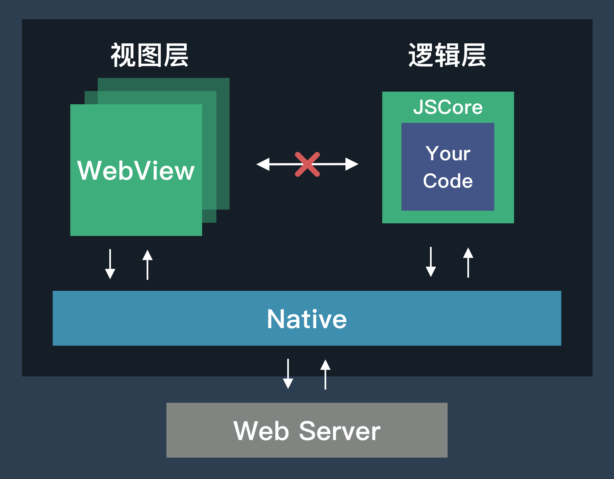

# 介绍

### Evoker

:::tip
本项目需要你了解 [Vue](https://github.com/vuejs/core) 的基本知识。
:::

为原生应用提供小程序运行环境，一个人能力有限，目前只支持 iOS。

可以直接使用 [Vue 3](https://github.com/vuejs/core) 编写小程序运行在原生客户端。

[组件](./../component/view.md) 和 [API](./../api/base/env.md) 对齐微信小程序。

### 运行环境

小程序的运行环境分为逻辑层和视图层。

所有业务代码只能运行在逻辑层中，逻辑层非浏览器环境，没有 `Window` \ `Document` 等浏览器接口，也就无法操作 `DOM`，可以把它理解为是一个类似 [Service Worker](https://developer.mozilla.org/zh-CN/docs/Web/API/ServiceWorker) 的环境。逻辑层不能直接和视图层交互，页面和组件通过 Vue Runtime 生成后经过 Native 同步到视图层，事件和网络请求也由 Native 转发。

[开始开始](./quick-start.md)
