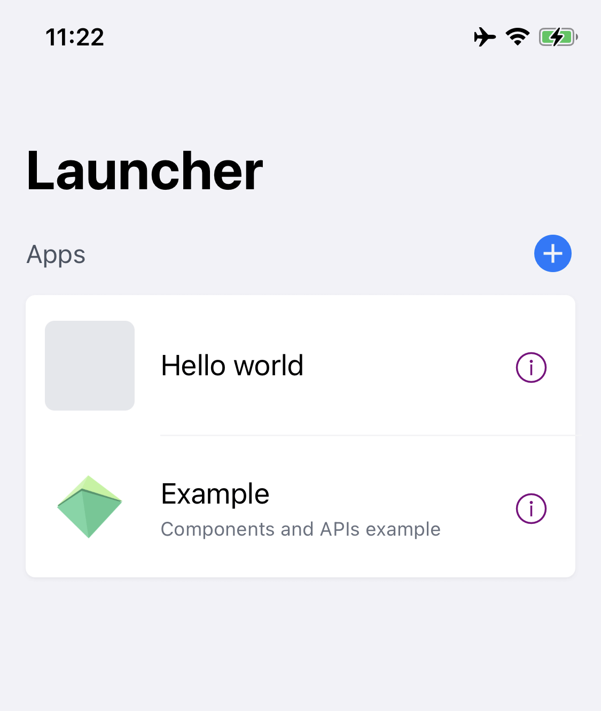
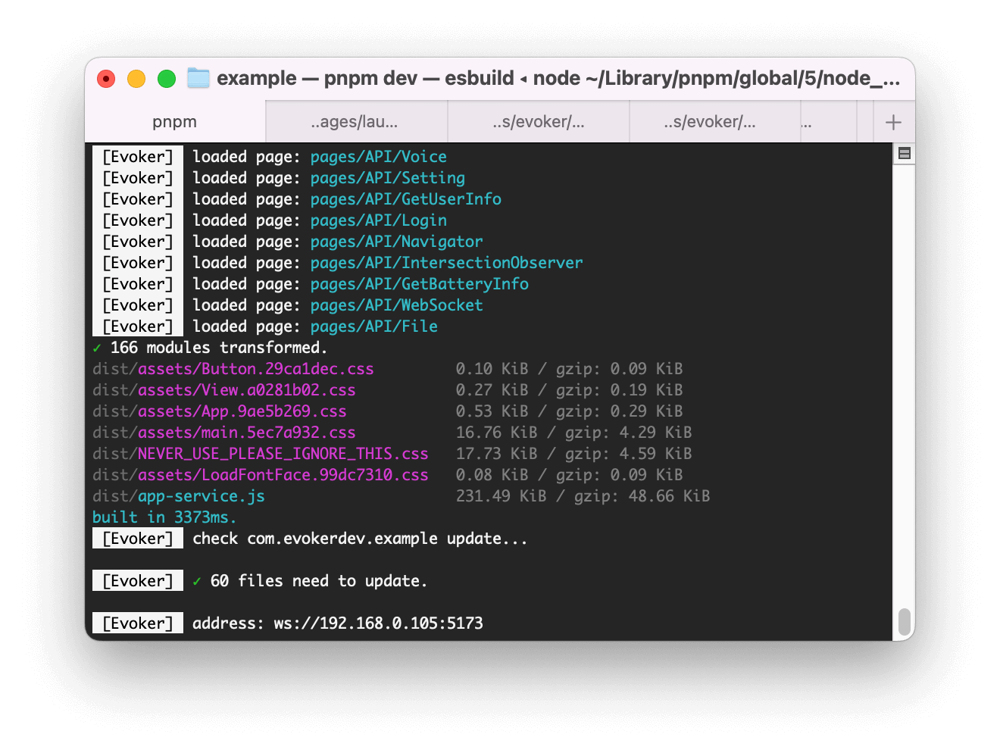

# 快速开始

:::tip
需要安装 [Node.js](https://nodejs.org)，[Xcode](https://developer.apple.com/xcode/)，[CocoaPods](https://guides.cocoapods.org/using/getting-started.html#installation)
:::

## 快速构建：

构建一个 Hello world 应用

<Tabs type="line" trigger="hover">
    <TabPane name="npm" tab="npm">
         <div class="language-sh"><span class="copy"></span><pre><code><span class="line"><span style="color:#A6ACCD;">npm create evoker my-app --template blank --platform iOS</span></span></code></pre></div>
    </TabPane>
    <TabPane name="yarn" tab="yarn">
         <div class="language-sh"><span class="copy"></span><pre><code><span class="line"><span style="color:#A6ACCD;">yarn create evoker my-app --template blank --platform iOS</span></span></code></pre></div>
    </TabPane>
    <TabPane name="pnpm" tab="pnpm">
         <div class="language-sh"><span class="copy"></span><pre><code><span class="line"><span style="color:#A6ACCD;">pnpm create evoker my-app --template blank --platform iOS</span></span></code></pre></div>
    </TabPane>
</Tabs>

所有模板：

- [blank](https://github.com/yizhi996/evoker/tree/main/packages/create-evoker/template-blank): Hello world

如果带上 `--platform iOS` 将会包含一个 Launcher

## 启动应用

启动 Dev Server

<Tabs type="line" trigger="hover">
    <TabPane name="npm" tab="npm">
         <div class="language-sh"><span class="copy"></span><pre><code><span class="line"><span style="color:#A6ACCD;">npm run dev</span></span></code></pre></div>
    </TabPane>
    <TabPane name="yarn" tab="yarn">
         <div class="language-sh"><span class="copy"></span><pre><code><span class="line"><span style="color:#A6ACCD;">yarn run dev</span></span></code></pre></div>
    </TabPane>
    <TabPane name="pnpm" tab="pnpm">
         <div class="language-sh"><span class="copy"></span><pre><code><span class="line"><span style="color:#A6ACCD;">pnpm run dev</span></span></code></pre></div>
    </TabPane>
</Tabs>

## 使用 Launcher 运行

iOS 模板中自带一个 Launcher, 可以添加和运行应用。

首次启动需要安装依赖

```sh
cd my-app/iOS

pod install --repo-update
```

启动 `iOS/Launcher.xcworkspace` 文件，点击运行（⌘ + R），等待应用启动完成。



点击右上角的 + 添加应用，输入 ws 地址

地址在 cli 的最后一行会输出：


## 修改代码

:::warning
使用 WebSocket 连接，需要在同一个局域网内。
:::

修改项目代码后保存（⌘ + S）将会自动更新到客户端。
